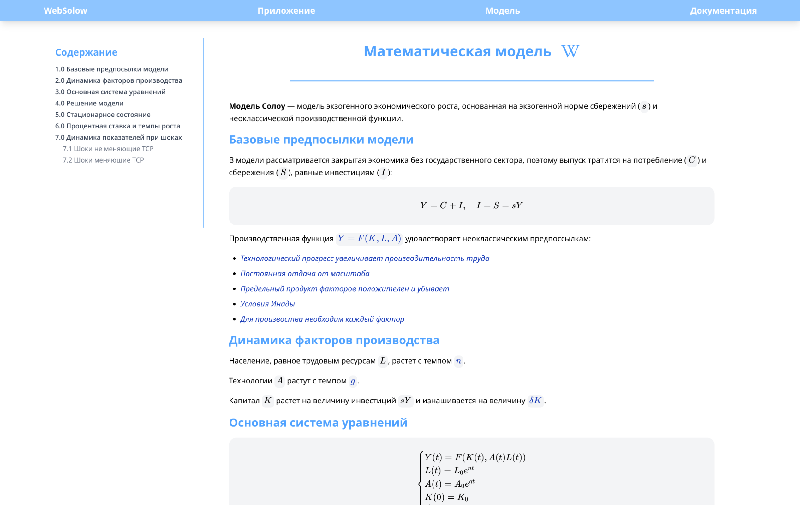
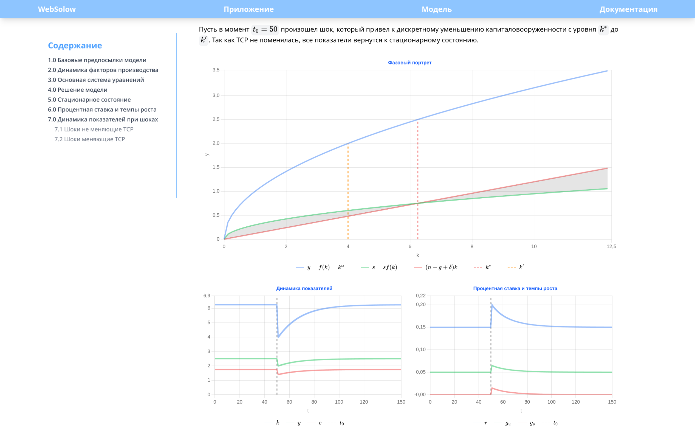
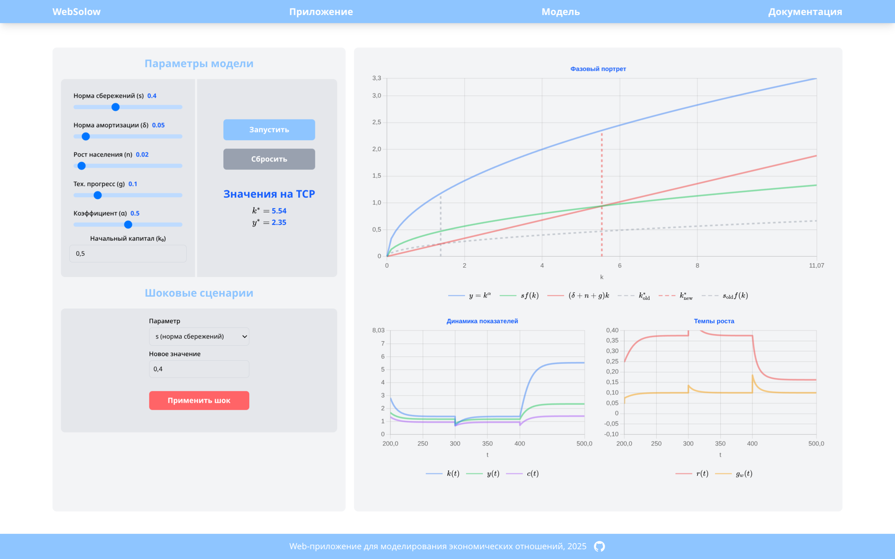

# WebSolow

Интерактивный веб-симулятор модели экономического роста Солоу

---

## Для пользователя

### Зачем это?

Модель Солоу — основополагающая модель всех современных теорий роста. Но сухие учебники, лекции и статичные графики не дают почувствовать, как на самом деле работает модель. **WebSolow** превращает абстрактные уравнения в интерактивный симулятор:

- Крутите ползунки — и фазовая плоскость перестраивается на глазах.
- Применяйте шоки — наблюдайте, как экономика сходит с равновесия и ищет новый баланс.
- Смотрите на динамику капитала, выпуска и потребления.

---

### Возможности

| Что можно делать | Как |
|---|---|
| Читать теорию | Страница `Математическая модель` с выводом основных формул |
| Менять начальные параметры модели | Ползунки для $s$, $\delta$, $n$, $g$, $\alpha$, $k_0$ |
| Запускать симуляцию | Кнопка `Запустить` — рассчитывается траектория |
| Применять шоки | Выбрать параметр, задать новое значение, нажать `Применить шок` |
| Шокировать факторы производства | $K$, $L$, $A$ — дискретно меняют капиталовооружённость |
| Изучать фазовый портрет | Производственная функция, сбережения, амортизация, ТСР |
| Смотреть динамику | $k(t)$, $y(t)$, $c(t)$ на временной шкале |
| Смотреть темпы роста | Процентная ставка $r(t)$ и рост зарплат $g_w(t)$ |
| Сбрасывать всё | Кнопка `Сбросить` — возврат к начальным параметрам |

---

### Как пользоваться

0. Для изучения теории перейдите на страницу `Математическая модель` — там полный вывод уравнений, hover-карточки с определениями и встроенные примеры графиков для каждого типа шока.
1. Откройте страницу `Приложение`.
2. Настройте параметры через ползунки в левой панели.
3. Нажмите `Запустить` — на трёх графиках появятся траектории модели по настроенным ранее параметрам.
4. В блоке `Шоковые сценарии` выберите параметр для шока, укажите новое значение и нажмите `Применить шок`. Экономика отреагирует — графики перерисуются.
5. Значения на траектории сбалансированного роста ($k^*$, $y*$) отображаются в правой части панели параметров.

---

### Скриншоты





---

## Для разработчика

### Технологический стек

| Категория | Технология |
|---|---|
| Фреймворк | React 19 + TypeScript 6 |
| Сборщик | Vite 8 |
| Стили | Tailwind CSS 4 |
| Графики | Chart.js 4 |
| Формулы | KaTeX + react-katex |
| Иконки | react-icons (Tfi, Ai) |
| Роутинг | React Router 7 |
| Линтер | ESLint 10 |
| Пакетный менеджер | npm |

Проект не использует серверную часть, вся логика выполняется в браузере.

---

### Архитектура

#### Уровень 1: Контекст (C4 Context)

```
┌──────────────────────────────────────────────────┐
│                    Пользователь                  │
│            (браузер, единственный клиент)        │
└─────────────────────────┬────────────────────────┘
                          │
                          ▼
┌──────────────────────────────────────────────────┐
│                     WebSolow                     │
│          React SPA, полностью на клиенте         │
│                 Облачный хостинг                 │
└──────────────────────────────────────────────────┘
```

Нет бэкенда, нет базы данных, нет API. Весь код выполняется в браузере. `SolowModel` — простой и легковесный вычислительный модуль на TypeScript.

#### Уровень 2: Компоненты (C4 Container)

```
┌─────────────────────────────────────────────────────┐
│                    MainLayout                       │
│    (Header + Footer, обёртка для всех страниц)      │
└─────────────┬───────────────────────────────────────┘
              │
      ┌───────┴──────────────┬─────────────────────┐
      ▼                      ▼                     ▼  
┌─────────────┐    ┌──────────────────┐    ┌───────────────┐
│   AppPage   │    │  MathModelPage   │    │    DocsPage   │
│  Симулятор  │    │ Теория + графики │    │  Документация │
└──────┬──────┘    └──────────────────┘    └───────────────┘
       │
  ┌────┴─────────────────┐
  ▼                      ▼
┌──────────────┐  ┌──────────────────────┐
│ SolowModel   │  │  Chart Nodes         │
│ (core math)  │  │  (useChart hook)     │
└──────────────┘  └──────────────────────┘
```

#### Уровень 3: Component (C4 Component)

Детализация внутренних компонентов каждого контейнера и их взаимодействие.

```
┌───────────────────────────────────────────────────────────┐
│                    AppPage (контейнер)                    │
│                                                           │
│  ┌─────────────────────────────────────────────────────┐  │
│  │                    AppPage.tsx                      │  │
│  │  useState: params, shockParams, updateVersion       │  │
│  │  useRef: modelRef, baseModelRef, trajectoryRef      │  │
│  │  handleStart, handleReset, handleApplyShock         │  │
│  └──┬──────────┬──────────────┬──────────────┬─────────┘  │
│     │ props    │ props        │ props        │ props      │
│     ▼          ▼              ▼              ▼            │
│  ┌─────────┐ ┌─────────┐ ┌───────────┐ ┌────────────┐     │
│  │ Phase   │ │Dynamics │ │  Growth   │ │  useChart  │     │
│  │ChartNode│ │ChartNode│ │ ChartNode │ │    init    │     │
│  │ фазовый │ │  k,y,c  │ │  r,gw(t)  │ │  destroy   │     │
│  └─────────┘ └─────────┘ └───────────┘ └────────────┘     │
│        │           │            │                         │
│        └───────────┼────────────┘                         │
│                    ▼                                      │
│          ┌──────────────────┐                             │
│          │  SolowModel      │                             │
│          │  (solowCore.ts)  │                             │
│          │  чистый math     │                             │
│          └──────────────────┘                             │
└───────────────────────────────────────────────────────────┘

┌───────────────────────────────────────────────────────────┐
│                MathModelPage (контейнер)                  │
│                                                           │
│  ┌─────────────────────────────────────────────────────┐  │
│  │                MathModelPage.tsx                    │  │
│  │  TOC-навигация (NavItem, slugify)                   │  │
│  │  LaTeX-уравнения (BlockMath, InlineMath)            │  │
│  │  HoverCard-определения                              │  │
│  └──┬──────────────────────────────────────────────────┘  │
│     │                                                     │
│     ▼                                                     │
│  ┌─────────────────────────────────────────────────────┐  │
│  │  Компоненты примеров графиков                       │  │
│  │  PhaseExampleChart  PhaseExampleChartEq             │  │
│  │  DynamicExampleChartEq  GrowthExampleChartEq        │  │
│  │  PhaseExampleChartNeq  DynamicExampleChartNeq       │  │
│  │  GrowthExampleChartNeq                              │  │
│  └─────────────────────────────────────────────────────┘  │
│     │                                                     │
│     ▼                                                     │
│  ┌─────────────────────────────────────────────────────┐  │
│  │  ChartConfig.js (конфиги 6 статических графиков)    │  │
│  └─────────────────────────────────────────────────────┘  │
└───────────────────────────────────────────────────────────┘

┌─────────────────────────────────────────────────────────┐
│  MainLayout (контейнер)                                 │
│  ┌──────────┐  ┌────────────────────┐  ┌────────────┐   │
│  │ Header   │  │  <main> {children} │  │   Footer   │   │
│  │ (fixed)  │  │  (роутер: page)    │  │            │   │
│  └──────────┘  └────────────────────┘  └────────────┘   │
└─────────────────────────────────────────────────────────┘
```

**Data flow в AppPage:**

```
Пользователь → updateModel → modelRef (SolowModel)
Пользователь → handleStart → trajectoryRef (TrajectoryPoint[])
Пользователь → handleApplyShock → baseModelRef + modelRef → simulateWithShock
updateVersion++ → useEffect в Chart Nodes → chart.data → chart.update('none')
```

---

#### Уровень 4: Code (C4 Code)

Ключевые программные элементы и их отношения.

```
┌───────────────────────────────────────────────────────────┐
│                    SolowModel                             │
│  (utils/solowCore.ts)                                     │
│                                                           │
│  get kStar(): number                                      │
│    (s / (delta + n + g)) ** (1 / (1 - alpha))             │
│                                                           │
│  get yStar(): number                                      │
│    kStar ** alpha                                         │
│                                                           │
│  y(k): number                                             │
│    k ** alpha                                             │
│                                                           │
│  dkdt(k): number                                          │
│    s * f(k) - (delta + n + g) * k                         │
│                                                           │
│  simulateTraj(steps): TrajectoryPoint[]                   │
│    Метод Эйлера на [0, tMax]                              │
│                                                           │
│  createPoint(t, k): TrajectoryPoint                       │
│    { t, k, y, c, r, gw, gy, dkdt, ... }                   │
│                                                           │
│  productionFunctionData(from, to): Point[]                │
│  sYLine(from, to): Point[]                                │
│  amortizationLine(from, to): Point[]                      │
│                                                           │
└───────────────────────────────────────────────────────────┘

┌───────────────────────────────────────────────────────────┐
│  TrajectoryPoint (interface)                              │
│  t: number      // время                                  │
│  k: number      // капиталовооружённость                  │
│  y: number      // выпуск на эффективную единицу труда    │
│  c: number      // потребление                            │
│  investment: number                                       │
│  amortization: number                                     │
│  dkdt: number   // производная капитала                   │
│  r: number      // процентная ставка                      │
│  gw: number     // рост зарплат                           │
│  gy: number     // рост выпуска                           │
└───────────────────────────────────────────────────────────┘

┌───────────────────────────────────────────────────────────┐
│  React-компоненты (ключевые пропсы)                       │
│                                                           │
│  AppPage (состояние + refs)                               │
│    props: нет (корневой)                                  │
│    children: PhaseChartNode, DynamicsChartNode,           │
│              GrowthChartNode                              │
│                                                           │
│  PhaseChartNode                                           │
│    props: modelRef, baseModelRef, shockParamRef, version  │
│                                                           │
│  DynamicsChartNode                                        │
│    props: modelRef, trajectoryRef, version                │
│                                                           │
│  GrowthChartNode                                          │
│    props: trajectoryRef, version                          │
│                                                           │
│  NavItem (interface)                                      │
│    label: string                                          │
│    level: number                                          │
│                                                           │
└───────────────────────────────────────────────────────────┘
```

---

### Как запустить

```bash
cd frontend
npm install
npm run dev          # http://localhost:5173
```

Сборка:

```bash
npm run build        # dist/
npm run preview      # preview production build
```

Линтинг:

```bash
npm run lint
```

---

### Ключевые модули

`utils/solowCore.ts — класс `SolowModel`.

`components/Wrapper/Wrappers.tsx` — компоненты `MainLayout`, `Inline`.

`app/routes.ts` — роутинг React Router.

---
